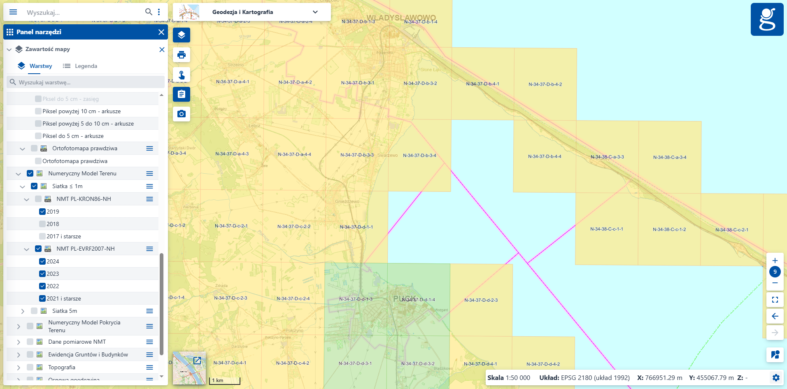

# Lidar Classification

Authors:
- Mikołaj Gałkowski
- Julia Przybytniowska
- Łukasz Tomaszewski
- Jakub Kubacki

----------------------

### Project setup

0. Install [uv](https://docs.astral.sh/uv/).
1. Sync with the project.

```bash
uv sync
```

Torch (cpu)
```bash
uv sync --extra cpu
```

Torch (gpu - cuda 11.8 - if you need different one, please change `pyproject.toml` file according to this [guide](https://docs.astral.sh/uv/guides/integration/pytorch/#installing-pytorch))
```bash
uv sync --extra cu118
```

2. Instal `pre-commit` [if not having in global python - `pip install pre-commit` or within `uv tool`].

```bash
uv tool install pre-commit
```

3. Install pre-commit hooks.

```bash
uvx pre-commit install
# (below equivalent to above, above one is more convenient)
uv tool run pre-commit install
```

-------------------------------------

## Data preparation

1. Download raw data from [EMODnet](https://emodnet.ec.europa.eu/geoviewer/) and place it in the `data/raw/shapefile/emodnet` directory and las file data from [Mobafire](https://www.mediafire.com/folder/u95l9197wjsiv/Monitoring#myfiles) and put them in `data/las` directory.

2. Find manually number of plots on the [Geoportal](https://mapy.geoportal.gov.pl/imapnext/imap/index.html?moduleId=modulGiK&mapview=51.978352%2C19.400858%2C4000000s). Instruction below.



### *Please take screenshot and put it in the `data/imgs` directory for future reference. Ideally please check which rectangles have been chosen by marking them.*


3.Process data using `prepare_data.py` script. (**Check more details about script arguments within the script.**)

```bash
uv run python -m src.prepare_data --plot_numbers ... --shapefile_path ... --folder_name ... --save_plots (flag, optional)
```

Sample execution:

```bash
uv run python -m src.prepare_data --plot_numbers "N-34-37-D-b-1-3","N-34-37-D-b-1-4","N-34-37-D-b-3-2","N-34-37-D-b-3-4","N-34-37-D-b-3-3","N-34-
37-D-d-1-1","N-34-37-D-d-1-3","N-34-37-D-d-1-4","N-34-37-D-d-2-3","N-34-37-D-d-4-1" --shapefile_path hel_gdansk_data/coastal_type_20210501_0_80k.shp --folder_name zatoka_przy_polwyspie --save_plots
```

This script produces the following outputs:
- `data/processed/<folder_name>` - processed LiDAR data (merged emodnet with las file, normalized, clipped, etc.)
- `data/plots/<folder_name>` - plots of the processed LiDAR data (if `--save_plots` flag is set)
- `data/torch/<folder_name>` - torch dataset files
- updates `data/processed/README.md` with the processed data information for future reference

Once all regions are processed organize data using `organize_data.py` script.
```bash
uv run python -m src.data_preparation.organize_data
```

## Training models

1. Prepare config (`config` folder), model architecture (`src/training/models.py`) and everything else needed.

2. Running training script:

Sample execution:
```bash
uv run python -m src.training.train --config_path config/config_resnet.yml
```


### Contributing:

1. When adding new dependency:

```bash
uv add <package-name>
```

----------------------

### Project structure

```bash
lidar-classification/
│── data/                   # Raw & processed LiDAR data
│   ├── las/                # Raw LiDAR point clouds (LAS/LAZ files)
│   │   └── ...
│   ├── processed/          # Processed LiDAR data (normalized, clipped, etc.)
│   │   └── ...
│   ├── raw/                # Raw LiDAR point clouds (LAS/LAZ files)
│   │   └── ...
│   └── torch/              # Torch dataset files
│
│── notebooks/              # Jupyter Notebooks for exploration
│   └── 01_data_exploration.ipynb
│   └── ...
│
│── src/                    # Source code
│   └── data_preparation
│       ├── ...
│       └── prepare_data.py # Main script for data preparation
│   └── training
│       ├── ...
│       └── train.py        # Main script for training
│
│── training_artifacts/     # Saved models, metrics, plots etc...
│   └── ...
│
│── results/                # Classification results & evaluation
│   └── ...
│
│── configs/                # Configuration files
│   └── ...
│
│── scripts/                # Utility scripts for automation
│   └── ...
│
│── tests/                  # Unit and integration tests
│   └── ...
│
│── .pre-commit-config.yaml # Pre-commit hooks (e.g., Ruff, uv)
│── pyproject.toml          # Python dependencies
│── .gitignore              # Ignore unnecessary files
└── README.md               # Project description
```